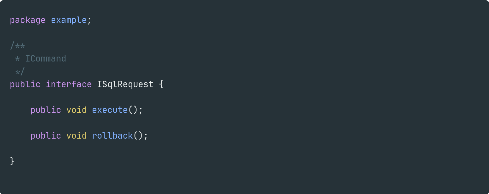
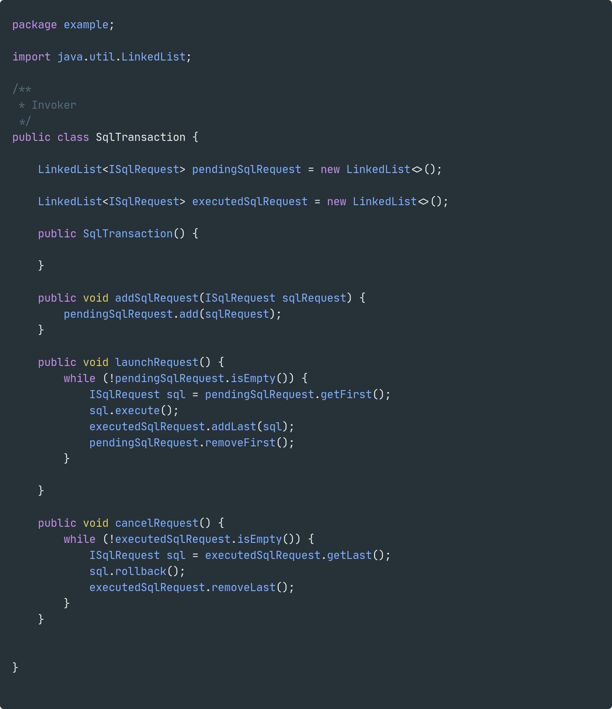
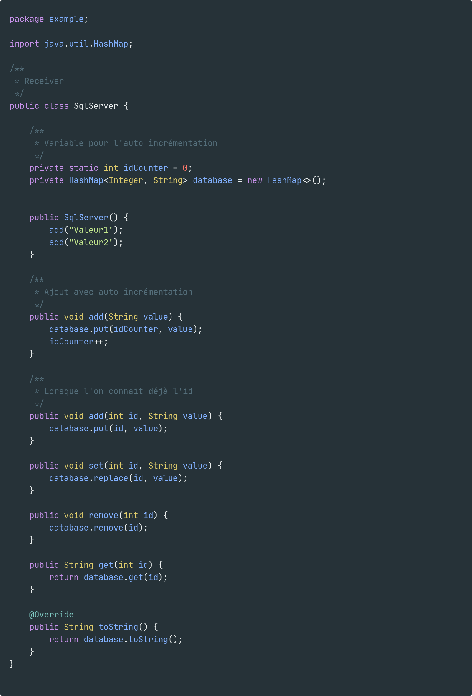
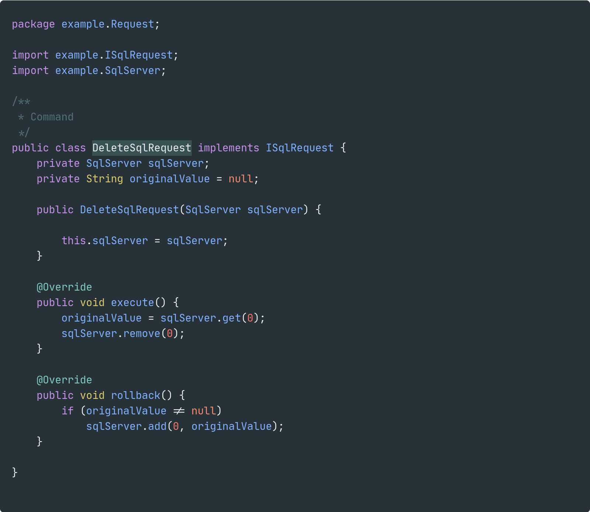
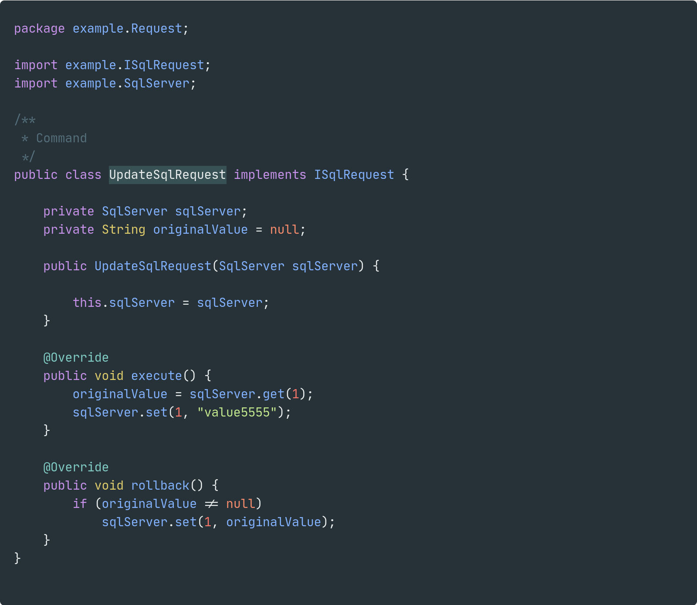
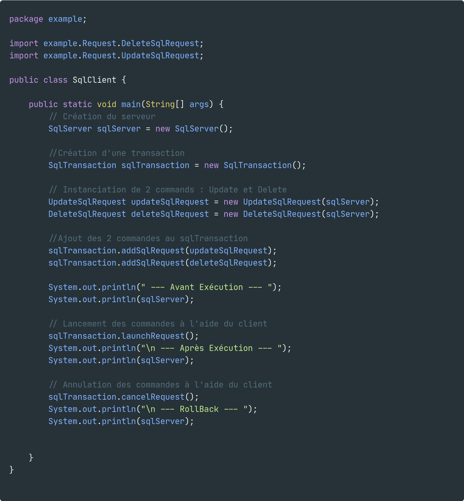

## Simon HEBAN & Ludwig SILVAIN- M1 WedSci

# Programmation orientée objet Avancée (M1) : Command Pattern

## Introduction

Le design pattern Command fait partie de la catégorie des patterns de comportements.
Tout d'abord il faut savoir qu'un patron de comportement permet d’identifier les modèles de communications entre les objets.

Le patron de commande permet d’encapsuler les commandes afin de garder un historique et de revenir à une version antérieure. Cette encapsulation permet de réaliser deux actions
- la première permettant d'exécuter la ou les commandes souhaitées
- la deuxième permettant de revenir en arrière (rollback).

Ce design pattern peut répondre notamment à un problème de sauvegarde de données lors de modifications délicates, telles que dans une base de données : si une instruction (par exemple une modification des données) échoue toutes les instructions faites depuis le début seront annulées (rollback).
On peut aussi retrouver l’utilité de ce patron dans les historiques de logiciels, par exemple Photoshop qui permet de revenir en arrière.

Ce patron de conception offre donc un système de journalisation des commandes et une indépendance entre les commandes et leur éxécuteur.

Sa mise en œuvre reste assez simple (voir le diagramme avec explication ci-dessous).
Le plus grand avantage de ce patron est de pouvoir encapsuler la commande, par conséquent l'invoqueur sera indépendant des actions réalisées par la ou les  commandes.
Il facilite l'ajout de nouvelles commandes sans que cela entraîne des changements importants. 

Le désavantage de ce design pattern est la lisibilité, en effet plus on a de commandes plus on aura de fichiers. Par conséquent, la quantité de code va augmenter assez rapidement.

## Explication

- `Invoker`:
L’invoker sera la classe qui invoquera la commande, pour ce fait elle aura besoin de connaître au préalable la cible (le receiver). 
Cette classe pourra avoir une propriété de type file (FIFO) contenant les commandes qui ne sont pas encore exécutés. 
Elle pourra aussi avoir une pile (LIFO) permettant de garder un historique des commandes faites. 
On pourra ainsi exécuter les commandes dans la file, ou bien annuler les commandes dans la pile.

- `ICommand`:
L’interface `ICommand` correspond à l'encapsulation des commandes, cela permet de généraliser ces dernières.

- `Command`:
Cette classe implémente `ICommand`. Elle hérite de deux méthodes : `execute` et `unexecute`. On pourra imaginer avoir plusieurs Commandes.

- `Receiver`:
La classe `Receiver` est la classe qui recevra la ou les commandes. C’est dans cette classe que l’action se déroulera.

- `Client`:
Cette classe appelle la classe `Invoker`. Elle doit préalablement connaître le receveur ainsi que la/les commandes à exécuter.

## Exemple

#### `ISqlRequest.java` _(ICommand)_

#### `SqlTransaction.java` _(Invoker)_

#### `SqlServer.java` _(Receiver)_

#### `DeleteSqlRequest.java` _(Command)_

#### `UpdateSqlRequest.java` _(Command)_

#### `SqlClient.java` _(Client)_

## Sources

- ["Command Pattern – Design Patterns (ep 7)" de Christopher Okhravi](https://www.youtube.com/watch?v=9qA5kw8dcSU)
- [Wikipedia Command pattern](https://en.wikipedia.org/wiki/Command_pattern)
- ["Design Patterns en Java - Les 23 modèles de conception (4e édition)" de l'édition ENI](https://www.editions-eni.fr/livre/design-patterns-en-java-les-23-modeles-de-conception-descriptions-et-solutions-illustrees-en-uml-2-et-java-4e-edition-9782409012815)
